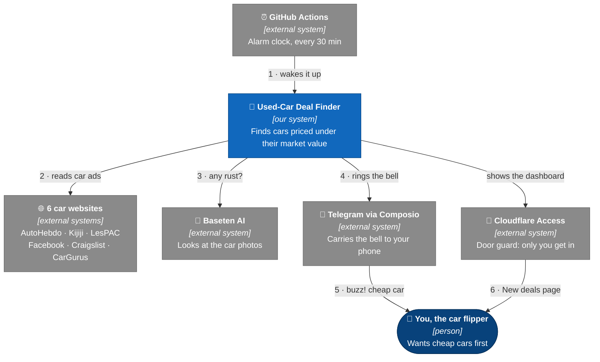
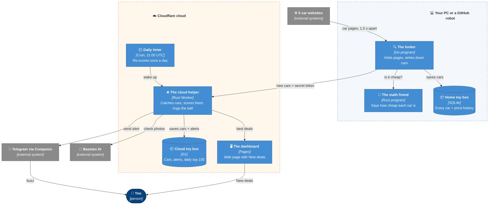
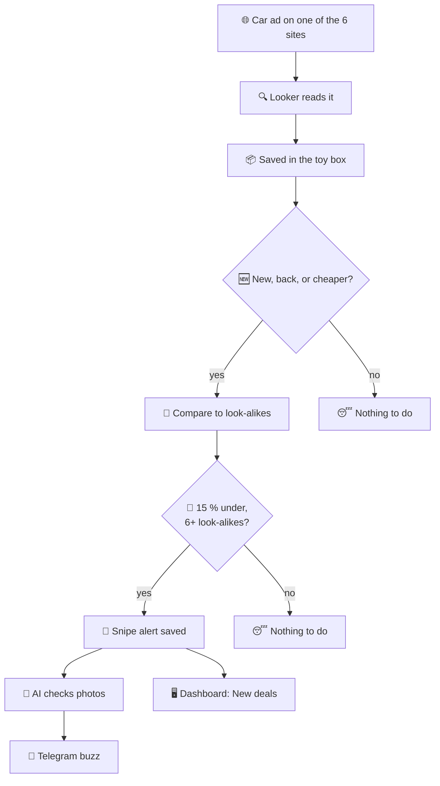
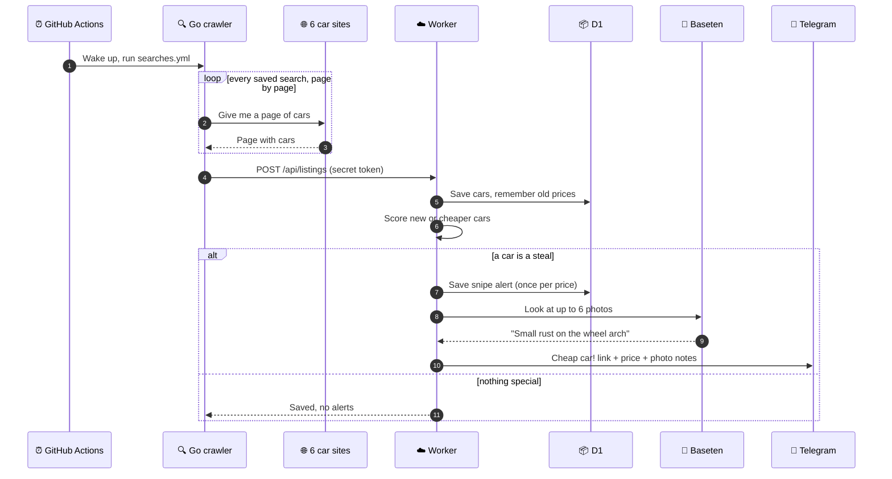
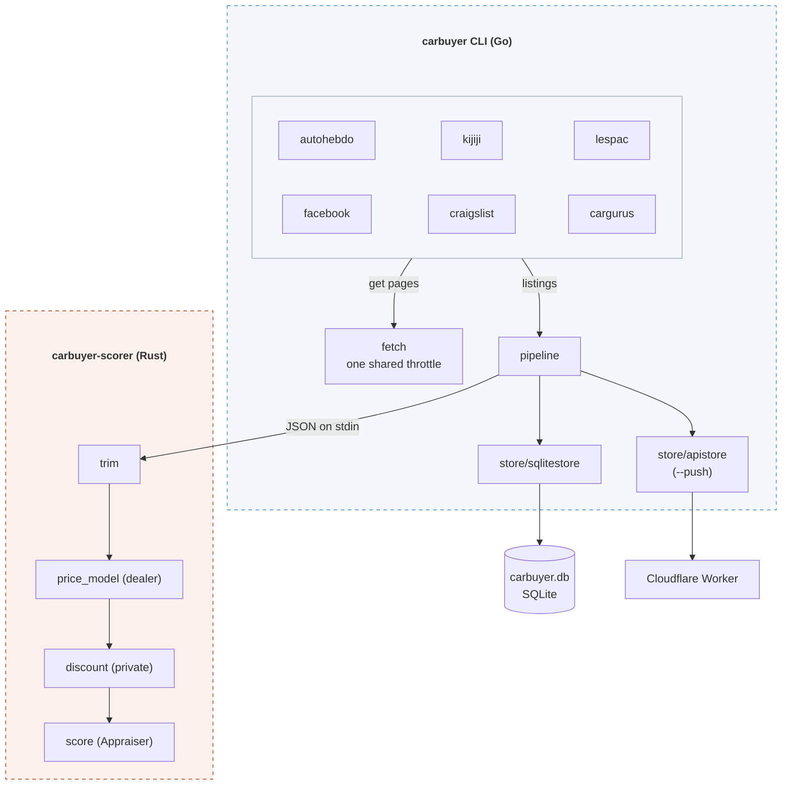

# Used-Car Deal Finder (carbuyer)

- A robot reads used-car ads in Ontario, every 30 minutes.
- It checks what cars like each one usually sell for.
- When a car is a lot cheaper than that, it sends you a message so you get there first.

## How it works

- **The looker** (a Go program) opens car websites and writes down every car it sees.
- **The math friend** (a Rust program) compares each car to cars like it and says how cheap it is.
- **The toy box** (a database, a place that keeps lists) remembers every car and every price it had.
- **The cloud helper** (a Cloudflare Worker) gets the new cars and rings a bell for the good ones.
- **The bell** is a snipe alert: a Telegram message saying "this one is cheap, go now".
- **The eyes** (an AI on Baseten) look at the photos for rust or dents before you drive out.
- **The alarm clock** (GitHub Actions) wakes the looker up every 30 minutes.

## What "cheap" means

- Take every car like this one: same model, close year, close km.
- Their usual price is the **baseline**.
- The bell rings when a car is **15 % or more under** the baseline and there were **at least 6** cars to compare.
- Broken cars, parts cars and "this price only with our loan" ads never ring it.
- Ontario cars are only compared to Ontario cars. Quebec to Quebec, if you turn Quebec on.

## The big picture (C4, level 1)

- C4 is a map with 4 zoom levels. Level 1 shows who talks to whom.
- Dark blue is a person, blue is this project, grey is someone else's service.
- Arrows go down, in the order things happen.



## The rooms inside (C4, level 2)

- The dashed boxes are where things run: your PC or a GitHub robot, and Cloudflare.



- Level 3 (the parts inside the Go program) is in [docs/architecture.md](docs/architecture.md).

## A car's trip



## Every 30 minutes



## Being polite to the websites

- One page at a time, at least 1.5 seconds apart, across all the sites together.
- It says it is a normal browser. No logins, no cookies, only pages anyone can open.
- At most 25 searches of 10 pages each per run.
- If a site says no even once, the run stops right there.

---

# For grown-ups

## The code

- `crawler/` (Go): one source per website, all turning ads into the same shape.
  The CLI saves them to SQLite, asks the scorer for prices, and can push them to the Worker.
- `scorer/` (Rust): builds the baseline and scores each car. The Worker reuses it.
- `cloudflare/`: the Worker, the D1 database, the daily cron and the dashboard.
- `.github/workflows/crawl.yml`: runs `crawler/searches.yml` every 30 minutes.
- It started as a Go and Rust copy of an older JavaScript tool (not in this repo).



- The scores come back on stdout as JSON, keyed by listing id.
- Sites that only give a free-text title (LesPAC, Craigslist, Facebook) find make and model
  in it by matching against the makes and models AutoHebdo and Kijiji already saved.
- AutoHebdo cars are priced against AutoHebdo cars. The others are priced against every site,
  because private sellers need the dealer prices to compare to.

## Build and test

- Needs Go 1.27 and stable Rust. No C compiler: SQLite is pure Go (`modernc.org/sqlite`).

```sh
cd scorer && cargo test && cargo build --release    # -> scorer/target/release/carbuyer-scorer
cd ../crawler && go vet ./... && go test ./...
```

## Run it

```sh
cd crawler
go run ./cmd/carbuyer --make toyota --model rav4 --geo reg_on --pages 3
go run ./cmd/carbuyer --source kijiji --geo ontario --pages 2
go run ./cmd/carbuyer --source facebook --geo toronto --pages 2
go run ./cmd/carbuyer --source craigslist --geo toronto
go run ./cmd/carbuyer --source cargurus --geo toronto --min-year 2020
go run ./cmd/carbuyer --make toyota --model rav4 --offline testdata/rav4-qc.html --min-comps 3   # no network
```

- `--source` picks the site, `--geo` the place. `carbuyer --help` lists every `--geo` value.
- The other flags match the old JS CLI, plus `--db`, `--scorer`, `--min-comps`, `--top`,
  `--offline`, `--push`, `--searches` and `--no-score`.
- The scorer also works alone: `carbuyer-scorer < listings.json > scores.json`.

## Scheduled crawl

- `crawler/searches.yml` is the list of searches. It watches Ontario.
  The Quebec searches are in the same file, commented out, ready to turn on.
- Unknown keys are refused, so a typo can't quietly drop a filter.
- Run it by hand with `go run ./cmd/carbuyer --searches searches.yml --no-score`.
  Add `--push <worker url>` and `CARBUYER_INGEST_TOKEN` to send the cars to the Worker.
- GitHub Actions runs it every 30 minutes once the secret `CARBUYER_INGEST_TOKEN` and the
  variable `CARBUYER_API_URL` are set ([DEPLOY.md](DEPLOY.md), step 10).
- Or run `scripts/crawl-and-push.ps1` from Windows Task Scheduler, if a site blocks cloud IPs.
  Pick one of the two, not both.

## Cloudflare

- `POST /api/listings` (bearer `INGEST_TOKEN`): saves the pushed cars in D1 and checks
  new, relisted or cheaper ones for snipe alerts.
- `GET /api/deals`, `/api/alerts`, `/api/snapshots/latest`: read by the dashboard,
  only through Cloudflare Access. `GET /api/health` is open.
- Cron `0 11 * * *` (UTC): re-scores everything and keeps the top 100, for 30 days.
- Run it all locally, no account needed:

```sh
cd cloudflare/worker && cp .dev.vars.example .dev.vars
npx wrangler d1 migrations apply carbuyer --local
npx wrangler dev --local --test-scheduled                                          # :8787
cd ../pages && npx wrangler pages dev public --service API=carbuyer-api            # :8788
```

- Locally, the Worker gave the same deals, in the same order, with the same scores as the CLI.
  Details in [docs/local-e2e.md](docs/local-e2e.md). Deploying: [DEPLOY.md](DEPLOY.md).
- Windows: the scorer links the C runtime statically, because `vcruntime140.dll`
  could not be read on the build machine.

## Snipe alerts

- A car is alerted once per price. If the price drops again, it is alerted again.
- The rule lives in `[vars]` in `cloudflare/worker/wrangler.toml` (15 %, 6 cars).
- The dashboard shows alerts at the top under New deals and refreshes every 2 minutes.
- Telegram turns on when `COMPOSIO_API_KEY`, `COMPOSIO_USER_ID` and `TELEGRAM_CHAT_ID` are set.
  Add `BASETEN_API_KEY` and each alert first gets an AI look at up to 6 photos.
- Another channel (email, push) is one new `Notifier` type and one line in `entry.rs`.

## Ported from JavaScript

- Ported: the six sites, fetch and throttle, parser, damage reader, geo, the SQLite store,
  the CLI, and the whole price model (trim, dealer baseline, private discount, appraiser).
- Not yet: the watcher, the old site and server, the other scripts, canonical model names.
- Not yet: saving extra fields some sites give (title, posting date, VIN, CarGurus price rating).
- Not yet: Craigslist remembering which ad pages it already read. It reads at most 20 per run.

## Same answers as the JavaScript

- `node parity/parity.mjs` runs the old JS next to the port, offline. Last run: all 15 checks pass.
- Same parser output on the saved page, and the same prices on 4 000 made-up cars,
  to the last decimal.
- Same database tables, and the old JS reads what Go saved.
- Small on purpose differences: odd input (wrong-type JSON, broken HTML entities,
  emoji inside the description reader's window) is handled without crashing.

## Tests

- Rust: 46 tests. Worker: 31 tests. Go: 437 tests. Clippy and `go vet` are clean.
- Nothing touches a real website. Tests use fake fetchers, local test servers
  and made-up ads (no real names, phone numbers, VINs or ad ids).
- A live check worked on every site in Quebec, and in Ontario on AutoHebdo, Kijiji,
  CarGurus and Craigslist. Facebook in Ontario has not been checked live yet.
- `crawler/testdata/rav4-qc.html` is a real AutoHebdo page with names, phones, addresses,
  ids and links replaced by fakes. Refresh it only with `tools/anonymize-fixture`.

## The websites

- **AutoHebdo**: lots of dealer cars, some private. Ontario (`reg_on`) or Quebec (`reg_qc`).
- **Kijiji**: private and dealer cars. Ontario or Quebec.
- **Facebook Marketplace**: mostly private sellers. 14 Ontario cities, or 4 in Quebec.
- **Craigslist**: private and dealer cars, much bigger in Toronto than in Quebec. Toronto and 11 more Ontario cities,
  or Montreal, Quebec City and Sherbrooke.
- **CarGurus**: dealers only, with CarGurus' own fair price. 100 km around Toronto or Montreal.
- **LesPAC**: private sellers, Quebec only. Kept as an option for Quebec.
