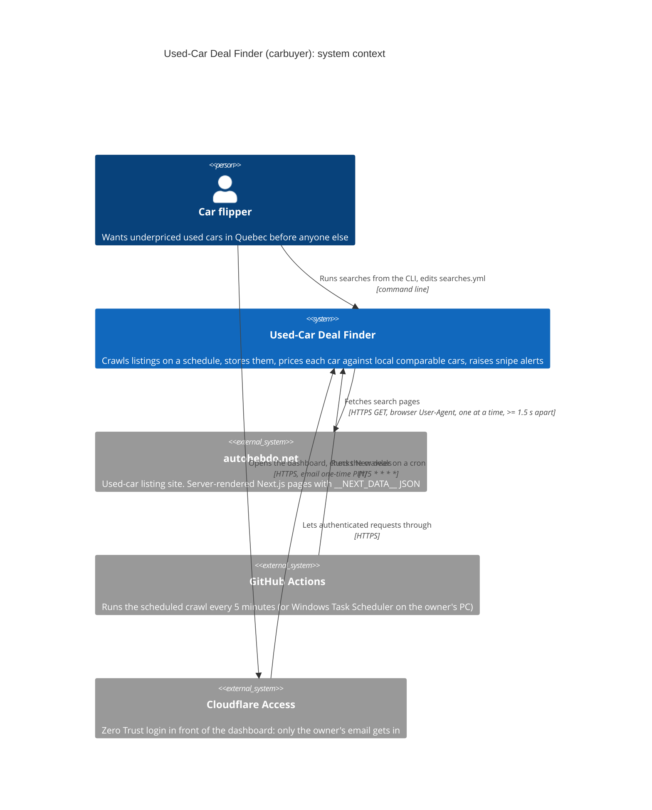
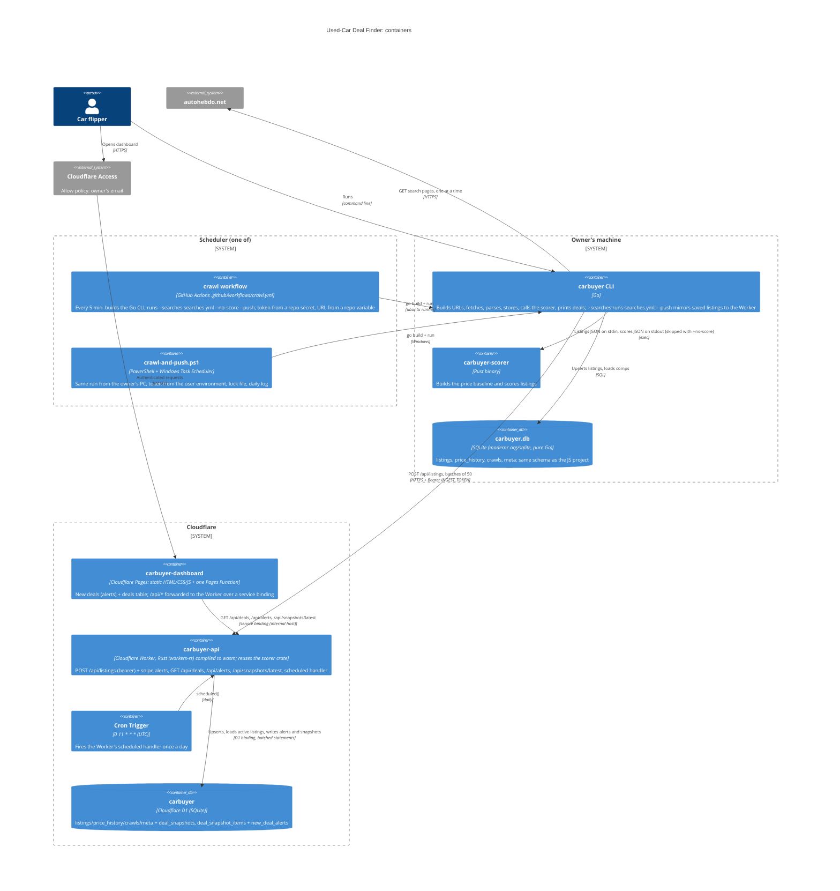
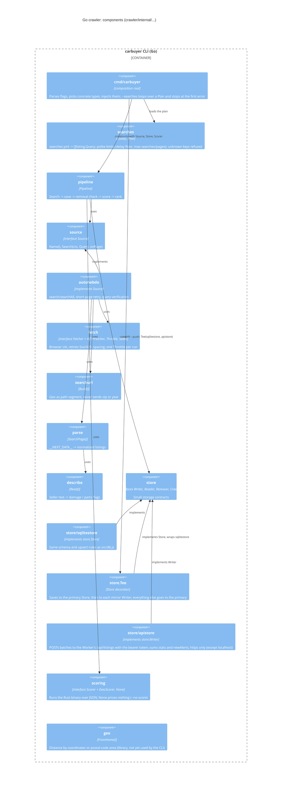
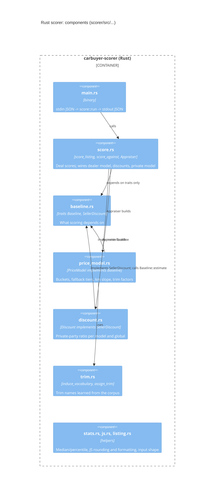
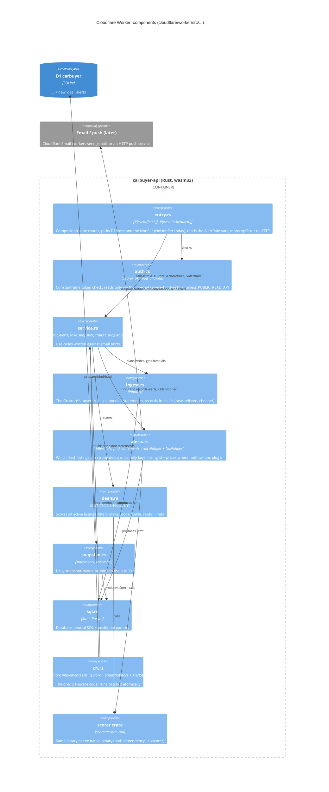

# Architecture

C4 diagrams in Mermaid (they render on GitHub), then how SOLID shows up in the code.

## Level 1: System context

## Level 2: Containers

## Level 3: Components of the Go crawler

## Level 3: Components of the Rust scorer

## Level 3: Components of the Cloudflare Worker

Snipe-alert flow on `POST /api/listings`: the planner upserts the batch and returns the
fresh ids; if there are none (the usual case once a search has been seen) nothing is
scored. Otherwise every active listing is scored once, fresh listings that pass the
`AlertRule` become `Alert`s, keys already in `new_deal_alerts` are dropped, the rest are
inserted (`INSERT OR IGNORE`) and handed to the `Notifier`. Alert errors are returned as
`alertError` and never undo the stored listings.

The Pages side is one file, `cloudflare/pages/functions/api/[[path]].js`: it
lets only GET/HEAD on the read routes (`/api/deals`, `/api/alerts`,
`/api/snapshots/latest`, `/api/health`) through and calls the Worker with
`env.API.fetch(...)` on the internal host, so the dashboard and its data share
one origin and one Access application.

## SOLID in this code

**Single responsibility.** Each package or module has one job.
- Go: `crawler/internal/searchurl` (URLs), `fetch` (HTTP), `parse` (page -> listings), `describe` (seller text), `autohebdo` (walking a query), `store/sqlitestore` (SQL), `scoring` (talking to the scorer), `pipeline` (the flow), `searches` (reading the scheduled-search file), `cmd/carbuyer` (flags and output).
- Rust: `scorer/src/price_model.rs` (baseline), `discount.rs` (private discount), `trim.rs` (trims), `score.rs` (deal scores), `main.rs` (I/O only).
- Go, Cloudflare side: `store/apistore` only speaks HTTP to the Worker; `store.Tee` only fans a save out to several writers.
- Worker: `ingest.rs` (upsert rules), `alerts.rs` (what is a strong new deal, its statements, the notifier port), `deals.rs` (scoring and ranking), `snapshot.rs` (cron rows), `auth.rs` (who may call what), `d1.rs` (D1 calls), `entry.rs` (HTTP and cron wiring). The scoring itself is not re-implemented: the Worker links the same `scorer` crate as the native binary.
- Scheduling is outside the code: `.github/workflows/crawl.yml` and `scripts/crawl-and-push.ps1` only build and run the CLI with `--searches`.

**Open/closed.** A new site, notifier or schedule is a new type or file, not an edit to the core.
- `crawler/internal/source/source.go` defines `Source`. Kijiji, LesPAC or Marketplace would each be a new package that implements it; `pipeline.go` does not change.
- `scorer/src/baseline.rs` defines `Baseline`. `score_listing` / `score_against` take `&dyn Baseline`, so a different baseline plugs in without changing the scoring rules.
- Pushing to Cloudflare was added without touching `pipeline.go`: `apistore` is a new `store.Writer`, and `store.Tee` wraps the existing store. The scorer crate was reused by the Worker without a single change.
- Snipe alerts were added without touching the scorer, `deals.rs` or `snapshot.rs`; the planner only gained a list of fresh ids. Email or push notifications are a new `Notifier` implementation chosen in `entry.rs`; `service.rs` and `alerts.rs` do not change (DEPLOY.md, "Email notifications later").
- Scheduled crawling reuses the pipeline as is: `--searches` just runs it once per entry of the plan.

**Liskov substitution.** Anything that satisfies the interface works in its place.
- The pipeline test (`crawler/internal/pipeline/pipeline_test.go`) runs the real `Pipeline` with fake source, store and scorer.
- `fetch.Static`, `fetch.HTTPFetcher` and the throttled wrapper are interchangeable `Fetcher`s; the CLI swaps them for `--offline`.
- `scoring.None` and `scoring.ExecScorer` are interchangeable `Scorer`s; `--no-score` swaps them and the pipeline runs unchanged.
- In Rust, the dealer and private `PriceModel`s are passed to `score_against` as the same `&dyn Baseline`.
- `store.Tee(db, pusher)` is a `store.Store` like `sqlitestore.DB`; the pipeline cannot tell them apart (`crawler/internal/store/tee_test.go`).
- In the Worker, `D1Store` and the in-memory `Fake` in `service.rs` tests both satisfy `ListingStore` + `SnapshotStore` + `AlertStore`; `NoNotifier` and the tests' recording `Outbox` (delivering or failing) both satisfy `Notifier`. The use cases run unchanged on either.

**Interface segregation.** Small interfaces.
- `crawler/internal/store/store.go` splits storage into `Writer`, `Reader`, `Remover`, `CrawlLog`; `Store` only composes them.
- `fetch.Fetcher` is one method. `scoring.Scorer` is one method. `SellerDiscount` in Rust is one method. `Notifier` is one method.
- `apistore.Client` implements only `store.Writer`: a push sink does not pretend to read, remove or log crawls.
- The Worker's ports are split: `ListingStore` (known, apply, active) for ingest and deals, `SnapshotStore` for the cron, `AlertStore` (alerted, save_alerts, recent_alerts) for alerts; only the use cases that need two of them ask for both (`take_snapshot`, `ingest_and_alert`), and `recent_alerts` needs `AlertStore` alone.

**Dependency inversion.** High-level code depends on abstractions; concrete types are injected.
- `pipeline.New(src, store, scorer)` takes interfaces. Only `crawler/cmd/carbuyer/main.go` names `autohebdo.New`, `sqlitestore.Open`, `scoring.ExecScorer` / `scoring.None`.
- `autohebdo.New(fetcher)` takes a `fetch.Fetcher`, not an HTTP client.
- No package-level mutable globals; clocks and sleeps are fields so tests can replace them.
- `main.go` is still the only place that picks concrete stores: `sqlitestore.Open`, and with `--push` `apistore.New` + `store.Tee`.
- Worker use cases take `&impl ListingStore` / `&impl AlertStore` / `&impl Notifier` and an `AlertRule` value; only `entry.rs` (the Worker's composition root) builds `D1Store` from the `DB` binding, picks `NoNotifier`, and reads the rule from `[vars]`. Planning code returns plain `Stmt` values, so everything except `d1.rs`/`entry.rs` is tested natively with `cargo test`.
- The Pages dashboard depends on the Worker through a service binding name (`API`), not a URL. The schedulers depend on the Worker through `CARBUYER_API_URL` and a token from the environment, never a value in the repo.
